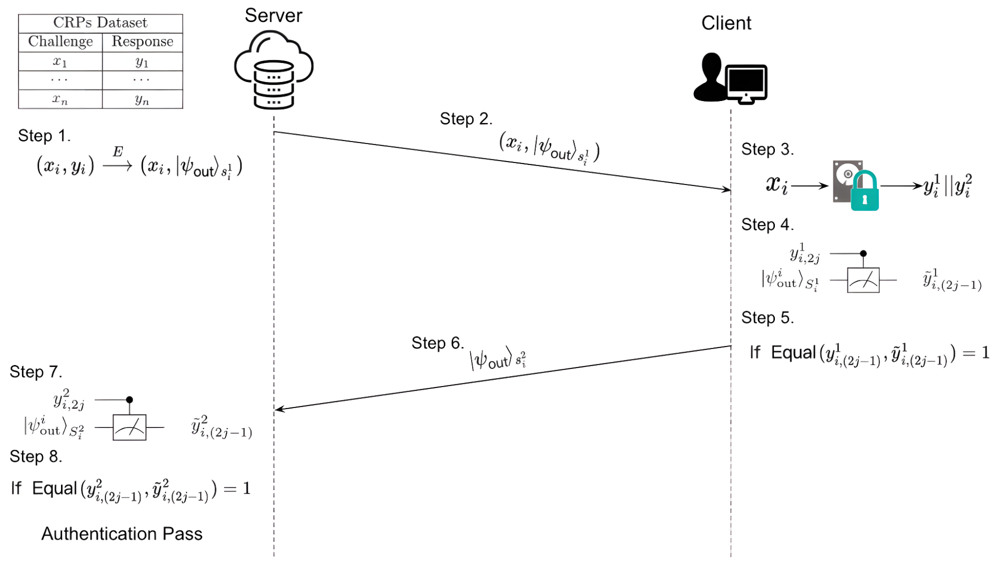

# Hybrid Locked PUF Simulation
A simulation of hybrid PUF (HPUF) performance with [pypuf](https://github.com/nils-wisiol/pypuf) and [netsquid](https://netsquid.org) in python inspired by the paper ["Quantum Lock: A Provable Quantum Communication Advantage"](https://arxiv.org/abs/2110.09469)

The idea of HPUF is to enhance the security of classical PUF by proposing quantum encoding on classical output of CPUF from adversary with modeling attacks. Meanwhile, a Lockdown technique is introduced to protect the HPUF authentication protocol from adaptive adversaries.

## Protocol Description:
We give a general description of a hybrid PUF-based authentication protocol with lockdown technique between a server and a client. See [paper](https://arxiv.org/abs/2110.09469) for more details.



**The Server's Resource:**

* A specification of hybrid PUF constructed upon a classical PUF.
* A database with all CRPs of CPUF.

**The Client's Resource:**

* The device of hybrid PUF with no compromise during the fabrication process and necessary quantum apparatus for encoding and measuring qubits.

**Authentication Protocol:**

* **Step 1:** The server randomly chooses a CRP and splits the response equally into two partitions.
* **Step 2:** The server encodes the first partition of response into quantum state and issues the joint classical challenge and quantum state to the client.           
* **Step 3&4:** The client receives the joint state and queries CPUF with challenge and obtains the response and measures every single qubit of received quantum state with the corresponding bases value of the 1st part of response. 
* **Step 5&6:** Authentication aborts if measurement result doesn't equal to the corresponding bits values bits of the 1st part of response. Otherwise the client encodes the second partition of response into quantum states and sends back to the server.
* **Step 7:** The server repeats Step 3&4 instead of querying CPUF but with the 2nd part of response from database directly. 
* **Step 8:** Authentication aborts if measurement result doesn't equal to the corresponding bits values bits of the 2nd part of response. Otherwise the authentication passes.


## Simulation with pypuf
Firstly, we simulate the performance with quantum encoding of HPUF compared to the classical structure in terms of against modeling attack. By quantum encoding on CPUF output interface, a network adversary without knowing the exact basis of each qubit can obtains CRPs obfuscated by certain randomness on the response. These cause a gap of required queries for modeling attacks. 

A evaluation of different quantum encoding strategies can be done regardless of considering quantum device noise within ```Simulation_pypuf``` sub-project. The simulation result can be found in the paper ["Quantum Lock: A Provable Quantum Communication Advantage"](https://arxiv.org/abs/2110.09469).

## Simulation with netsquid

An easy demo of 2-party Hybrid PUF-based Authentication Protocol (BB84 states) with Lockdown Technique is shown in ```./hlpuf_bb84.py```. (TBA: Loss/noise simulations and adversarial model)

## Contributors
* Kaushik Chakraborty
* Mina Doosti
* Yao Ma
* Chirag Wadhwa
