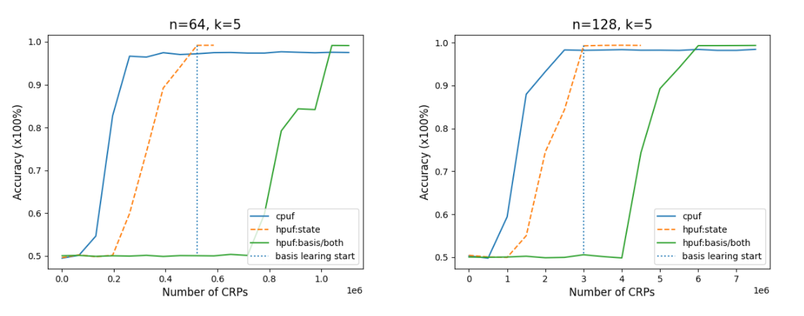

# Simulation with pypuf

## BB84 encoding
We provide a simulation of HPUF with BB84 encoding (See paper for more details) and an underlying of k-XORPUF (k=4/5 with ```bb84_xorpuf4.py/bb84_xorpuf5.py```). Run the simulation with command as follows:
```
python bb84_xorpuf5.py
```
to perform a modeling attack on HPUF. It outputs the prediction accuracy of CPUF/HPUF with corresponding CRPs. 

The optimal success probability of BB84 encoding to extract actual response of CPUF from HPUF by adversary is 85%, which leads a randomness of 15% on the response obtain by adversary.  

The simulation results is given as follows (with a challenge size n=64/128):



## MUB8 encoding