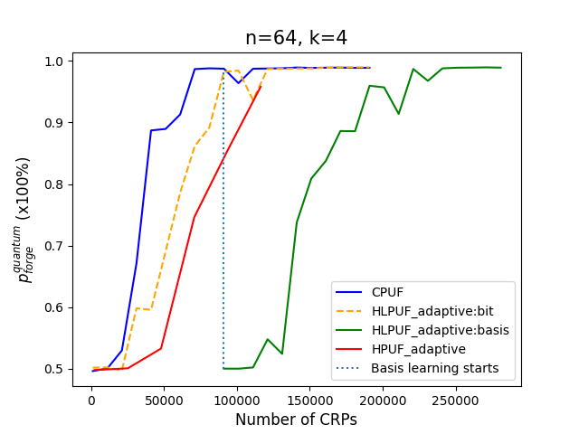
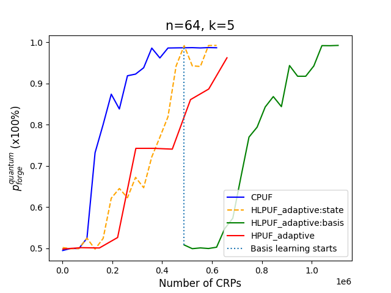

# Simulation with pypuf

## BB84 encoding
We provide a simulation of HPUF with BB84 encoding (See paper for more details) and an underlying of k-XORPUF (k=4/5 with ```bb84_xorpuf4.py/bb84_xorpuf5.py```). Run the simulation with command as follows:
```
python bb84_xorpuf5.py
```
to perform a modeling attack on HPUF. It outputs the prediction accuracy of CPUF/HPUF with corresponding CRPs. 

The optimal success probability of BB84 encoding to extract actual response of CPUF from HPUF by adversary is 85%, which leads a randomness of 15% on the response obtain by adversary.  

The simulation results is given as follows (with a challenge size n=64/128):
<p align="middle">
  
   
</p>

<p align="middle">
  
   
</p>

## MUB8 encoding
We provide a simulation of HPUF with 8-dimensional MUB encoding on a 5-XORPUF. ```mub_prob.py``` defines the optimization and the probability calculations for the MUB encoding (d = 4 and d = 8). Execute ```mub_xorpuf5.py``` to perform the simulation and store the data in the ```mub_data``` folder. The simulation results can be plotted by executing ```mub_data/plot.py```. 

The simulation results (for challenge size n = 32) are shown below:

